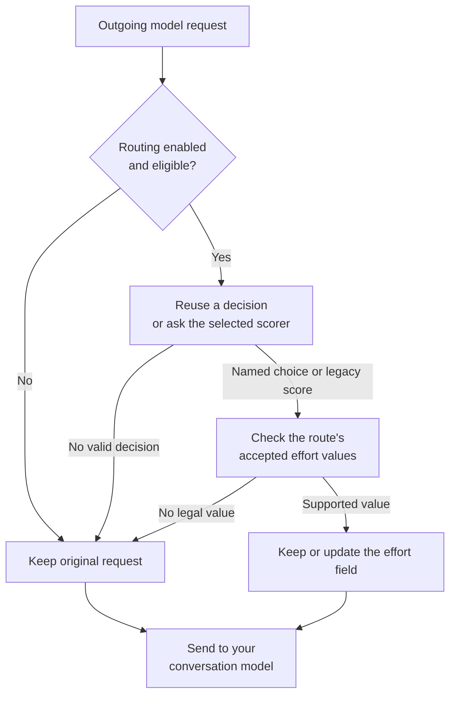
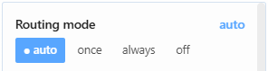

# Hermes Adaptive Effort

[](https://github.com/atostivint/hermes-adaptive-effort/actions/workflows/ci.yml) [](https://github.com/atostivint/hermes-adaptive-effort/actions/workflows/security.yml)

A Hermes plugin that asks a separate scorer to judge a task, then adjusts the reasoning effort of the outgoing model request.

Your conversation model still answers the task. You choose the scorer: Jev (the default), OpenAI Decisions, an OpenRouter model, Cloudflare Clef / Clef Flash, or a custom hosted or local endpoint.

> **Preview:** v0.3.0 is a pre-release. Live effort acceptance is only partially validated; see the [release notes](docs/releases/v0.3.0.md#validation-status--read-before-relying-on-it).

The plugin starts **off**. When you enable routing, it changes a supported effort field and can add a missing field on exact registered routes. If classification fails, the original request continues unchanged.

## Quick start

### 1. Install and enable the plugin

```bash
hermes plugins install 'atostivint/hermes-adaptive-effort' --enable
```

The repository root is the plugin payload; install without a subdirectory suffix. Hermes manages installation and updates. The payload is not a Python package.

An older CLI may require installation without `--enable`, followed by:

```bash
hermes plugins enable hermes-adaptive-effort
```

### 2. Provide the scorer key

For the default Jev scorer, make `TYPESAFE_API_KEY` available before launching Hermes.

Linux / macOS:

```bash
export TYPESAFE_API_KEY="YOUR_KEY"
```

Windows PowerShell:

```powershell
$env:TYPESAFE_API_KEY = "YOUR_KEY"
```

These examples apply to the current terminal session. For persistent keys, services, another scorer or a local model, follow the [configuration guide](docs/CONFIGURATION.md). Keep secrets out of `config.yaml`.

### 3. Restart the serving Hermes process

Restart your local agent, or restart the gateway:

```bash
hermes gateway restart
```

Desktop connections can use separate agent processes. Reconnect the connection that will serve your requests.

### 4. Check readiness and choose a mode

In Hermes chat:

```text
/hae status
/hae auto
```

Status checks readiness without classifying anything. Enabling a routing mode authorizes sharing bounded task text with the selected scorer. The chat command applies to future requests in the current process; save the mode in Desktop plugin settings if it should survive a restart.

## Choose when to evaluate effort

| Mode | Behavior |
| --- | --- |
| `off` (default) | No scoring or request changes |
| `auto` | Evaluate each new user turn on exact verified dynamic routes; otherwise retain one decision per model and route |
| `once` | Retain one decision per model and route for the conversation |
| `always` | Evaluate every new user turn on eligible routes |

Every active mode reuses its decision during a tool loop. A route includes the provider, exact model and API mode. Bounded decision memory can be evicted or cleared on reset/reload.

Use `/hae help` for all commands. The [usage guide](docs/USAGE.md) explains mode selection, status, probing and troubleshooting.

## How a request passes through the plugin



For exact registered routes, the selected scorer chooses directly from that route's allowed levels. For example, Kimi K3 offers `low/high/max`, OpenAI's GPT-6.1 Sol route offers `low/medium/high/xhigh/max`, and native Claude Opus 5.5 offers those same five levels. Claude Opus 4.6 offers `low/medium/high/max`, without `xhigh`. One-level routes are fixed without a scorer call. Routes without an exact choice vocabulary keep the legacy finite `0..2` score mapped to `low`, `medium` or `high`; `/hae probe` also keeps that score contract. A route change re-clamps the stored named level using the compatibility rules and never promotes `xhigh` to the new route's `max` automatically.

The scorer receives the latest user text, or the parent-written goal for a registered subagent. Scoring and answering are separate calls with separate costs. The allowed levels are included in the scorer question; model identity and observed effort are shared only when `use_target_model_context` is enabled.

See [Design](docs/DESIGN.md) for the component diagram and [Contracts](docs/CONTRACTS.md) for the tool-loop sequence and failure rules.

## Desktop and terminal

The optional Desktop extension adds an Effort chip with a compact **Routing mode** popup. **More** reveals conversation and scorer details plus recent applied changes for that chat; **Activity** shows aggregate status. In a Hermes chat, `/hae` opens the same conversation's recent history, and `/hae status` summarizes its model, selected effort and cache behavior.



The popup keeps the four routing modes together. See the [interface guide](docs/USAGE.md#desktop-and-terminal) for notifications, focused-chat status and the native effort selector.

The chip matches decisions to the chat's stored conversation ID; Desktop's temporary runtime ID is used only for session actions. Both live events and status polling follow this distinction.

## Data sharing and limits

- Enabling routing sends at most `prompt_chars` task characters (default 4,000), plus optional classifier guidance and the allowed level names for named-choice routes, to the selected scorer. Target model context is a separate opt-in setting.
- `/hae probe <text>` explicitly scores the text you type, even while routing is off. It stores no decision and may incur charges.
- The plugin excludes prompts and guidance from status, logs and change events. Provider retention is separate; see [data sharing](docs/CONFIGURATION.md#data-sharing).
- Applied-change history stores only effort transitions, model names and bounded decision metadata in the active Hermes profile. It retains at most 64 changes per conversation and 64 conversations; a conversation reset clears its history. It never stores task or prompt text.
- Reasoning support alone does not prove that a route accepts an effort field. The [compatibility matrix](docs/MODEL_COMPATIBILITY.md) distinguishes registered controls, documentation and live observations.
- Explicitly disabled or malformed reasoning controls stay untouched. Subagents have an independent mode that also defaults to `off`.
- Cost savings, cache benefits and answer-quality improvements remain unmeasured. Classification adds latency and may add cost.

## Update or disable

```bash
hermes plugins update hermes-adaptive-effort
hermes plugins disable hermes-adaptive-effort
```

Restart the serving agent after updates or enable/disable changes. `/hae off` stops routing for future requests in the current process.

For migration from `jev-auto-effort`, follow [migration instructions](docs/USAGE.md#migrate-from-jev-auto-effort).

## Documentation

| You want to… | Start here |
| --- | --- |
| Configure a scorer, keys or advanced settings | [Configuration](docs/CONFIGURATION.md) |
| Choose a mode or diagnose a missing change | [Usage](docs/USAGE.md) |
| Understand the implementation and trade-offs | [Design](docs/DESIGN.md) · [Version française expliquée](docs/DESIGN.fr.md) |
| Check exact behavior and API contracts | [Contracts](docs/CONTRACTS.md) |
| Check a model/provider route | [Compatibility](docs/MODEL_COMPATIBILITY.md) |
| Contribute and reproduce checks | [Development](docs/DEVELOPMENT.md) |
| Find dated reports and operator notes | [Documentation index](docs/README.md) |

## License

[MIT](LICENSE) © 2026 Alexandre Tostivint and contributors.
