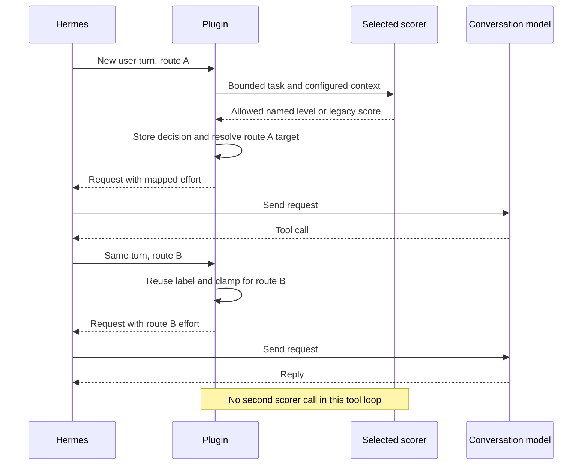

# Runtime contracts

[Usage](USAGE.md) · [Configuration](CONFIGURATION.md) · [Design and architecture](DESIGN.md) · [Exact route evidence](MODEL_COMPATIBILITY.md)

This page describes the implementation contract. Configuration owns settings/defaults and provider setup; Compatibility owns the exact model/provider inventory and its evidence.

## Decision scope

The only public modes are `auto`, `once`, `always` and `off`. Parent and subagent modes default to `off`. Unknown configured values become `off`; the plugin neither translates old mode names nor rewrites configuration.

| Mode | Scope |
| --- | --- |
| `auto` | Per new user turn only for exact registered dynamic model/API routes with positive cache-safety evidence, including the guarded Claude per-message path; otherwise retained session/provider/exact-model/API-route scope |
| `once` | Retained session/provider/exact-model/API-route scope |
| `always` | Per new user turn on every eligible route |
| `off` | No scoring or request rewrite; bounded route metadata can remain visible |

Without a turn ID, active modes use retained route scope. The dynamic registry includes the exact OpenCode Go/Zen control routes and `openai-codex/gpt-6.1-sol` on `codex_responses`, subject to transport cache safety, plus the separately guarded native Claude per-message route. An existing field, an `effort_models` entry or a model profile grants no dynamic capability.

Turn decisions key on `(session_id, turn_id)`. Retained decisions key on `(session_id, provider, exact model, api_mode)`. Each ledger has its own `max_turns` bound. A new session, eviction, reset or reload can require a new classification.

The latest user text in `messages` or Codex `input` is the task. Assistant messages, tool results and earlier history are not substituted for a new task. Registered children instead use the parent-written goal.

## Turn reuse and route changes

The example below uses an active mode that needs a fresh decision. The scorer now returns a named level when the route has an exact vocabulary, and a legacy score only when it does not. The same turn then changes route during a tool loop:



A retained route decision can replace the first scoring call. Returning to an already retained route on a later turn reuses that route's decision. Inside a classified turn, its label wins across route changes; `_target_for_route` re-clamps it instead of replaying a stale wire value. A new route is seeded only if it has no prior retained decision.

If a classified turn's fallback request has no usable effort control, the turn status names the fallback route, reports `unsupported` with the current failure reason, and clears the unapplied target. It retains the earlier label for a later eligible request in the same turn; that request re-clamps the label without another scorer call, including when a control appears on the same route. An earlier failed or in-flight scorer claim remains unchanged, so an ineligible fallback cannot trigger a second scoring attempt.

`api_call_count` does not identify a new turn. `_IN_FLIGHT` and `_ROUTE_IN_FLIGHT` coordinate concurrent claims; another request does not spend a duplicate scoring call. Failed/unsupported decisions are not retried in their selected scope while retained. Ineligible controls exit before scorer transport and do not authorize later field insertion.

Completed-turn `on_session_end` events with a turn ID preserve bounded decision state for status. Actual `on_session_finalize` / `on_session_reset` boundaries clear it. Child stop/cleanup also removes registered goals.

## Writable controls and route vocabulary

Middleware prefers an existing writable field, in this order:

1. `extra_body.reasoning.effort`
2. Top-level `reasoning_effort`
3. Top-level `reasoning.effort`
4. On exact native Anthropic routes only, `output_config.effort`

A missing field can be added only on exact registered routes or exact operator-listed `effort_models` IDs, and only on known Responses/Chat Completions carriers. Responses uses top-level `reasoning.effort`; Chat Completions uses top-level `reasoning_effort`. Paired routes additionally require the incoming `extra_body.thinking.type="enabled"`. Anthropic is a separate exact-route exception: `output_config.effort` is read or added only for registered model IDs on the HTTPS `api.anthropic.com` Messages route. `effort_models` cannot authorize it.

The plugin never adds that thinking toggle, enables disabled controls or overwrites malformed controls. `none` and explicit disabled reasoning remain untouched. Rewrites copy the request and affected container rather than mutating the original object.

`effort_models` matches normalized exact bare IDs across providers, strips an optional leading namespace, and accepts comma/newline-separated tokens. It authorizes a known carrier, not vendor acceptance or dynamic support. It cannot authorize Anthropic or an unknown API shape.

The legacy score contract remains a finite numeric value in `0..2`:

| Score | Label |
| --- | --- |
| `0 <= score < 0.5` | `low` |
| `0.5 <= score < 1.5` | `medium` |
| `1.5 <= score <= 2` | `high` |

Booleans, non-numeric values, NaN/infinity and out-of-range values are invalid. This path remains in use for `/hae probe` and routes without an exact named-choice registry. On registered routes, the scorer receives only the model/API route's allowed names and must return one of them; an invalid name or refusal fails open, with no score fallback. A route with a single allowed level is fixed without a scorer call. Named choices exclude `none` and `ultra`.

The exact-choice registry is route-specific. It uses the OpenCode Go/Zen insertion tables, the exact `openai-codex/gpt-6.1-sol` Responses route, and registered native Anthropic Messages model IDs. It never derives extra levels from a generic OpenAI-compatible provider, `effort_models`, or a local documentation profile. Examples include Kimi K3 `low/high/max`, GPT-6.1 Sol `low/medium/high/xhigh/max`, and Claude Opus 4.6 `low/medium/high/max` (no `xhigh`). The current exact Anthropic vocabulary and per-message subset are listed in [Compatibility](MODEL_COMPATIBILITY.md#native-named-choice-routes).

Labels from a named-choice decision are re-clamped when the same turn changes route. The existing `medium → high` exception remains where declared; a named `xhigh` is never promoted to the new route's `max` merely because that is its strongest value. The target records the value actually sent. `openai-codex` legacy-score mapping skips the narrow vocabulary table and uses Hermes' route data.

| Mapping source | Contract |
| --- | --- |
| Exact OpenCode Go registry | Use the route's declared wire values before broader host data |
| Exact Muse tiers | Keep standard and Contributor vocabularies distinct; Contributor excludes `max` |
| Kimi K3 | `low/high/max`; `medium` maps upward to `high` |
| GLM-5.2/5.3 outside exact entries | Use the corresponding Hermes host constants; do not infer proxy support from upstream documentation |
| Other routes with an existing field | Use Hermes route data; unknown routes can receive the broad OpenAI-compatible fallback |
| Missing controls | Broad fallback is insufficient; require the exact registry or operator assertion above |

The exact Go `glm-5.3` entry uses `low/high/max`, with `medium → high`. This is distinct from vendor-profile metadata and from any broader vocabulary in a particular Hermes host. The [compatibility matrix](MODEL_COMPATIBILITY.md) lists the exact insertion routes and other model-specific sets.

Hermes' verified effort ladder is `none/minimal/low/medium/high/xhigh/max/ultra`; `ultra` is internal and not a wire value. A rubric label and its final route target need not match. If the target already matches the request, no rewrite occurs.

Vendor acceptance is separate from local mapping. Fail-open handling of a scorer failure cannot intercept a later provider rejection of a rewritten request. Historical observations for retired routes belong in the [dated reviews](README.md#historical-evidence).

## Scorer adapter contracts

Selection is explicit: Jev, OpenAI Decisions, OpenRouter, Cloudflare or custom. An error never selects another scorer. Required credentials resolve through Hermes secret scope, then environment. Presence checks return booleans and do not expose secrets.

| Adapter | Request/response boundary |
| --- | --- |
| Jev | System One `state.prompt` and configured `jev_model`; registered routes use a `choice` question and `answers.effort.choice`, otherwise use the legacy score question and `answers.effort.score` |
| OpenAI Decisions | Fixed `/v1/decisions`; one bounded string input; exact-choice routes use one `effort` choice question and accept its named answer, otherwise accept one valid `effort` score answer |
| OpenRouter | Fixed Chat Completions endpoint, explicit model, JSON response request and 32-token completion cap; require ZDR and deny data collection |
| Cloudflare | Account-scoped Clef/Clef Flash route; require `success: true`, no reported errors and a valid named choice or legacy `result.answers.effort.score` |
| Custom System One | Exact configured URL/model; choice question on exact-choice routes, otherwise score question; read the matching `answers.effort.choice` or `.score` |
| Custom Chat Completions | Exact configured URL/model, JSON response request, temperature zero, no streaming and 32-token cap; exact-choice routes require only `{"effort":"<allowed level>"}`, other routes require the legacy finite `0..2` score JSON |

Custom servers used with an exact-choice route must implement the named-choice contract. A server that only returns scores fails open on such a route; there is no second request or legacy retry. A probe always uses the legacy score contract.

Custom endpoints must be valid HTTP(S) URLs without embedded credentials or fragments. Auth `none` performs no key lookup; `bearer` requires the custom key. Status masks query values. The adapters do not follow redirects or retry transport errors. OpenAI Decisions confidence/probabilities do not change the shared thresholds.

[Configuration](CONFIGURATION.md#configure-your-scorer) owns model defaults, keys and endpoint setup. [Data sharing](CONFIGURATION.md#data-sharing) owns the shared input and provider-retention boundary.

## Failure behavior

`on_llm_request` catches internal exceptions and leaves the request unchanged.

| Situation | Outcome | Transport calls |
| --- | --- | --- |
| Missing required credential/model or invalid scorer configuration | `failed`, original request | 0 |
| Timeout, HTTP/transport error or malformed score/choice | `failed`, original request | At most one in the selected decision scope |
| No writable field and no authorized insertion | `unsupported`, original request | 0 |
| Explicitly disabled reasoning | `unsupported`, original request | 0 |
| Named choice is refused, malformed or outside the exact allowed set | `failed`, original request | At most one; no score fallback |
| Label cannot map to a legal route value | `unsupported`, original request | A legacy score may already exist |
| Exact route has one allowed value | Fixed decision, no scorer call | 0 |
| Target already matches | Valid decision, no rewrite/event | Reused decision or one classification |
| Internal plugin exception | Original request | No retry by the middleware |

Stable scorer failure codes: `invalid_prompt`, `credential_missing`, `http_error`, `timeout`, `transport_error`, `malformed_response`, `unexpected_error`, `classifier_error`.

Configuration codes: `model_missing`, `unsupported_provider`, `account_missing`, `account_invalid`, `endpoint_missing`, `endpoint_invalid`, `unsupported_api_format`, `unsupported_auth`.

Unsupported-control codes: `reasoning_disabled`, `effort_control_unsupported`, `effort_value_unsupported`. Decisions refusals use `malformed_response`. A recorded classification attempt can have zero HTTP calls, for example when a key is missing.

## Subagents

A registered child is classified from its parent's goal only when both the main mode and `subagent_mode` permit routing. Child decisions use their own session/turn identity. Goals live transiently in a separate bounded registry and are excluded from logs/status.

## Commands and status schemas

`/hae` opens the current conversation's recent applied-change history. `/hae history [N|all] [full]` selects the number of retained changes and whether to show expanded metadata. `/hae status` is a concise current-conversation summary; `status full` adds details, and `status json` retains the machine-readable aggregate payload. `help`, `probe <text>` and the four mode verbs remain available. Mode verbs affect future requests in this process. Unknown modes, unsupported arguments and missing probe text return usage.

History is stored in the active Hermes profile, scoped by conversation identity, and bounded to 64 changes per conversation and 64 conversations. It contains only applied rewrites and prompt-free metadata. To resolve one conversation across ID rotations, the local database also keeps lookup aliases, including the stored session ID and the host's `HERMES_SESSION_KEY` when present; a platform session key may embed chat or user identifiers. Aliases are never returned by `/hae` or `GET /history`. Reset removes the reset conversation's history. Storage errors never affect requests.

`status` does no classification. `probe` scores operator text plus configured guidance, stores no routing decision and never infers a target route/profile.

Public schemas:

| Surface | Schema |
| --- | --- |
| Status | `hermes-adaptive-effort.status.v2` |
| Probe | `hermes-adaptive-effort.probe.v1` |
| Applied changes | `hermes-adaptive-effort.changes.v1` |
| Conversation history | `hermes-adaptive-effort.history.v1` |
| Desktop decision event | `hermes-adaptive-effort.desktop-status.v2` |

Status v2 adds `decision_type` (`native_choice`, `legacy_score` or `fixed`), the route's `choices`, and `cache_behavior`; named/fixed decisions report `score: null`, put the chosen level in `label`, and expose the sent value in `target`. Probe remains v1 and still returns its numeric score. The Desktop reader accepts both event v1 and v2 during transition. `command._ENTRY_FIELDS` is the sole rendered decision-field allowlist. Status includes route/scorer metadata, counters, `credential_required`, credential presence and Cloudflare account readiness. It reports only guidance presence/character count, not contents. Aggregates avoid double-counting a retained route decision and its turn memo.

### Anthropic per-message effort

The plugin enables the cache-preserving path only for the exact native HTTPS host, the registered API model IDs in the Compatibility table, an exposed `extra_headers["anthropic-beta"]` string, a Messages request with `messages`, and no `thinking.type="between_tools"`. It appends `mid-conversation-output-config-2026-07-01` to that existing header while retaining every other beta value. A missing or malformed header does not qualify.

For a per-message change, the plugin adds an empty-content system message with `output_config.effort` immediately before that user turn. The top-level `output_config.effort` stays unchanged, so the Desktop session selector is not synchronized for this route. It replays each stored marker at the same turn boundary on later requests. The bounded registry stores levels and hashes/positions only, never message text. Missing anchors (including compression), a manually changed initial setting, a reset/eviction or an internal error invalidates continuity and fails open; cache preservation is not promised across those events. When the effective beta header is unavailable, `auto` retains a route decision; `always` may update the top-level field and status labels that path `top_level_cache_may_reset`.

## Dashboard API

Routes mount under `/api/plugins/hermes-adaptive-effort/`:

| Method/path | Contract |
| --- | --- |
| `GET /status` | Status schema; 503 when the backend cannot provide status |
| `GET /changes` | Changes schema; 503 when the backend cannot provide the feed |
| `GET /history?conversation_id=…&limit=10` | Bounded applied changes for that conversation in this profile |
| `POST /mode` | JSON `{"mode":"auto","persist":false}`; runtime change by default |
| `POST /probe` | JSON `{"text":"operator-typed task"}`; probe schema without prompt echo |

`POST /mode` accepts optional `persist`, default `false`. With `true`, it also saves `plugins.entries.hermes-adaptive-effort.settings.mode` through Hermes' settings writer. A successful result includes the applied mode/scope; an explicit persistence attempt includes `persisted`.

`GET /history` returns `hermes-adaptive-effort.history.v1` with `conversation_id`, `available`, and events containing only `id`, timestamp, model, `from`, `to`, and cache verdict. It clamps the requested limit to 1–64 and never returns a conversation-wide list. A storage failure returns 503 without affecting request routing.

Unknown modes return HTTP 400; unavailable middleware/mode application returns 503. A failed persistent write returns HTTP 500 with `persist_failed`, while the process-local mode change can already have succeeded. Public errors omit exception text. Blank probe text returns 400; host request validation can also reject malformed bodies.

### Anonymous applied-change feed

`GET /changes` returns:

```json
{
  "schema": "hermes-adaptive-effort.changes.v1",
  "plugin": "hermes-adaptive-effort",
  "stream_id": "opaque-process-stream",
  "events": [{"id": 1, "from": "high", "to": "low", "at": 0.0}],
  "latest": {"id": 1, "from": "high", "to": "low", "at": 0.0}
}
```

The example illustrates shape, not a captured live event. Middleware's `effort_change_state()` returns the stream/events/latest state; the API adds its schema and plugin ID.

The ring retains at most 64 actual rewritten transitions. It contains effort values and timestamps, without prompts or session IDs. Off, failed/unsupported attempts, unchanged values and tool loops resending the applied value emit no change. Insertions use `from: absent`.

Deduplication uses `(decision_key, from, to)`. A reset/reload creates a new `stream_id`; consumers must drop their old cursor. This global feed cannot identify the focused conversation.

## Desktop events and selector synchronization

Middleware best-effort broadcasts `plugin.hermes-adaptive-effort.decision.updated`. Its versioned payload contains the stored `conversation_id` (the agent's session ID), process stream ID, increasing revision, exact route, allowlisted status, `selector_sync_supported`, and an optional applied marker `{id, from, to, at}`. The compatibility field `runtime_session_id` also carries that stored ID; its historical name does not mean a Desktop gateway runtime ID. `clear: true` with null status marks actual finalize/reset.

Desktop scopes decisions by source connection/profile and stored conversation ID, accepts increasing revisions, and invalidates earlier state on a clear/new stream. It matches REST status and live decisions to `focusedStoredSessionId`, or the current stored ID learned from an owner-scoped `session.info` event for `focusedSessionId`. That event's `stored_session_id` follows compression/session rotation; mappings are bounded to 64 runtime sessions and ignore replayed events. A fresh child-process decision takes precedence over an empty/older parent-process REST snapshot. Background events can update cached status, but do not toast or synchronize the selector, including on later focus.

Only a fresh real applied rewrite for the same focused owner/stored-conversation/model route may synchronize Hermes' native selector. The public `config.set` call uses `key: reasoning`, the already-clamped target, the focused gateway runtime `session_id` and `scope: session`. The runtime binding is checked again after asynchronous route resolution. It never writes global settings.

No RPC occurs for a replay, repeated marker, no-op, failure, unsupported result, off event or background event. Manual selector changes remain until a later fresh applied rewrite. Switching routing off leaves the session setting in place.

Child-isolated sessions advertise `selector_sync_supported: false`; Desktop gives a notice instead of calling the parent's API. In supported sessions, a matching `session.info` must confirm owner, runtime session, stored conversation, model and effort within five seconds. Rejection or missing confirmation produces a concise notice without retry or global fallback; the already-applied request is unaffected.

The [usage guide](USAGE.md#desktop-and-terminal) describes display behavior. Display switches do not alter classification; hiding the Desktop popup does not disable session-scoped selector synchronization.

## Privacy and transport evidence

Task text, classifier guidance and composed target context are excluded from logs, reasons, status, probe output and change feeds. Optional target context has an independent 1,400-character bound; guidance has a 2,000-character bound; `prompt_chars` caps task text only. These limits do not guarantee provider retention.

Profiles come from local versioned data and exact-ID lookup. They cannot authorize injection, alter clamping or establish cache safety. The [profile maintenance guide](DEVELOPMENT.md#adding-target-model-profiles) describes the catalog contract.

The verified Hermes Responses transport constructs top-level `reasoning.effort` and applies middleware after preflight. Chat Completions uses `reasoning_effort`; paired routes require an existing enabled-thinking control. The [compatibility matrix](MODEL_COMPATIBILITY.md) separates vendor documentation, Hermes routing and actual completed requests.

An Anthropic-style transport can render thinking configuration into the prompt. Dynamic `auto` requires positive cache-neutral transport evidence plus an exact dynamic model/API registration. `always` can reevaluate eligible routes without that cache verdict. No live cache-hit, total-cost or answer-quality A/B result is claimed.
