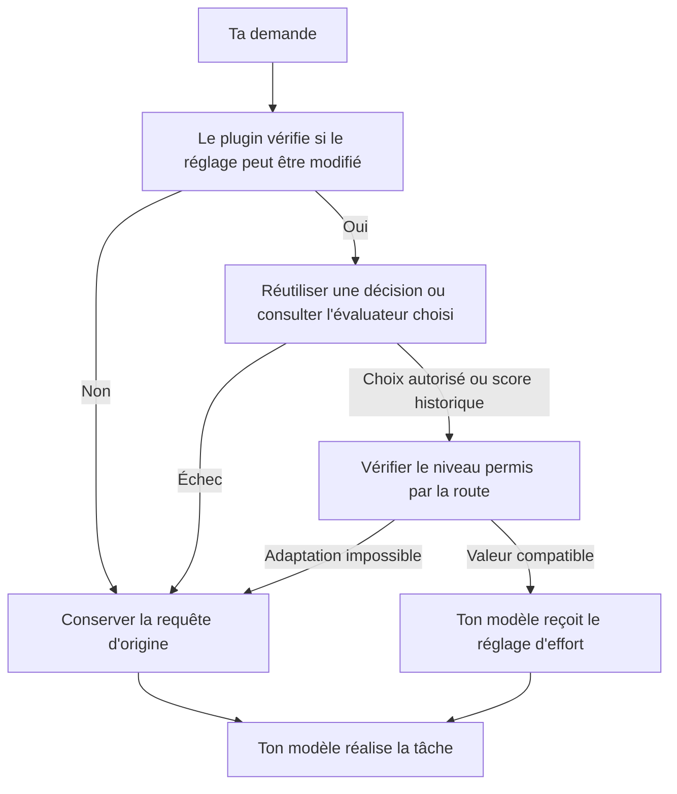

# Conception et architecture — version française expliquée

Cette page reprend le [document de design](DESIGN.md) en français, avec davantage d'exemples et moins de jargon. Elle décrit le code du dépôt vérifié le **7 octobre 2026**.

## 1. À quoi sert le plugin ?

Hermes Adaptive Effort choisit le **niveau d'effort de raisonnement demandé au modèle** pour une tâche. Il conserve le modèle que tu as choisi pour la conversation.

L'idée est d'éviter de demander systématiquement le même effort pour « corrige cette phrase » et pour « analyse ce bug qui touche plusieurs services ».

Le plugin règle un paramètre de la requête envoyée au modèle. Il ne choisit pas les étapes du raisonnement, ne fixe pas leur nombre et ne vérifie pas lui-même la justesse de la réponse. Le modèle de conversation reste responsable du travail.

Le projet est conçu pour un usage personnel quotidien : une fonction ciblée, une interface compacte et des détails accessibles quand on en a besoin.

## 2. L'évaluateur choisit-il toujours entre trois niveaux ?

Non. **Le format dépend de la route exacte utilisée par ton modèle de conversation.** Si le plugin connaît précisément le fournisseur, le modèle et le type d'API, il donne à l'évaluateur la liste des niveaux acceptés et lui demande d'en choisir un directement.

| Route exacte | Choix présentés à l'évaluateur |
| --- | --- |
| OpenCode Go / Kimi K3 | `low`, `high`, `max` |
| OpenAI Codex / GPT-6.1 Sol | `low`, `medium`, `high`, `xhigh`, `max` |
| API native Anthropic / Claude Opus 5.5 | `low`, `medium`, `high`, `xhigh`, `max` |
| API native Anthropic / Claude Opus 4.6 | `low`, `medium`, `high`, `max` — pas de `xhigh` |
| OpenCode Zen / Muse Spark 1.3 Contributor Free | `minimal`, `low`, `medium`, `high`, `xhigh` — pas de `max` |

La route compte autant que le nom du modèle : un proxy, un autre type d'API ou un identifiant voisin ne reçoit pas automatiquement les mêmes choix. Les niveaux `none` et `ultra` ne sont jamais proposés à l'évaluateur. Une route qui n'autorise qu'un seul niveau utilise celui-ci sans appel de classification.

L'évaluateur reçoit une courte explication de chaque niveau et doit choisir **le niveau le plus faible qui suffit**. `xhigh` est réservé aux tâches particulièrement difficiles ou longues ; `max` n'est choisi que si l'effort supplémentaire semble pouvoir améliorer la justesse. Un texte long ou un sujet technique ne suffit pas, à lui seul, à justifier une hausse.

Quand le vocabulaire exact de la route est inconnu, le système garde l'ancien format : l'évaluateur renvoie un score numérique entre **0 et 2**, que le plugin convertit ainsi :

| Score reçu | Catégorie | Sens de la consigne |
| --- | --- | --- |
| De 0 inclus à 0,5 exclu | `low` — faible | Tâche courte et délimitée, avec peu d'étapes |
| De 0,5 inclus à 1,5 exclu | `medium` — moyen | Plusieurs étapes et un peu de jugement |
| De 1,5 inclus à 2 inclus | `high` — élevé | Ambiguïté, contraintes qui interagissent ou analyse difficile |

Par exemple, `0.2` donne `low`, `0.9` donne `medium` et `1.8` donne `high`. Ce sont des exemples, pas des mesures sur des tâches réelles. `0.5` appartient à `medium` et `1.5` à `high`. La commande `/hae probe` utilise toujours ce format historique. Un score plus précis ne produit pas un réglage plus précis ; il n'est ni un pourcentage de confiance ni une mesure du temps de réflexion.

Si la route change pendant un cycle d'outils, le plugin réutilise la décision du tour puis l'adapte au nouveau vocabulaire. Il ne transforme pas automatiquement `xhigh` en `max` sur ce nouveau modèle. Les valeurs exactes et les règles de conversion sont dans la [compatibilité des modèles](MODEL_COMPATIBILITY.md) ; une règle locale ne constitue pas, à elle seule, un test réussi chez le fournisseur.

## 3. Deux rôles différents : évaluer et répondre

L'évaluateur juge l'effort utile. **Ton modèle de conversation répond à ta demande.**

Le plugin propose cinq choix de fournisseur pour l'évaluation : Jev, OpenAI Decisions, OpenRouter, Cloudflare et un service personnalisé, éventuellement local. Jev est le choix par défaut. Ces services peuvent recevoir une question à choix nommé ou l'ancien contrat de score, selon la route de réponse.

Il utilise uniquement l'évaluateur sélectionné. En cas de panne, il ne transmet pas automatiquement la tâche à un autre service : cela changerait le destinataire des données et pourrait entraîner une facturation non choisie.

Une nouvelle évaluation ajoute un appel avant celui du modèle de conversation. Elle ajoute donc du délai et peut ajouter un coût. Réutiliser une décision évite cet appel supplémentaire.

## 4. Quand refait-on l'évaluation ?

Un **tour** commence avec un nouveau message de l'utilisateur. Il peut inclure plusieurs appels au modèle et plusieurs utilisations d'outils avant la réponse finale.

Une **route** désigne ici une combinaison précise : fournisseur, identifiant exact du modèle et type d'API. Deux accès au même modèle peuvent avoir des comportements différents.

| Mode | Comportement |
| --- | --- |
| `off` | Aucune évaluation automatique et aucune modification de la requête. C'est le mode par défaut. |
| `once` | Conserver une décision pour cette conversation et cette route, tant qu'elle reste en mémoire. |
| `always` | Réévaluer chaque nouveau tour sur les routes où le réglage peut être modifié. |
| `auto` | Réévaluer chaque nouveau tour seulement sur les routes précisément enregistrées comme dynamiques, avec une vérification positive de compatibilité du cache. Ailleurs, conserver une décision par conversation et par route. |

Exemple : tu commences par « salut », puis tu demandes une analyse complexe. En `once`, la décision prise pour « salut » peut encore s'appliquer. En `always`, la nouvelle demande reçoit une nouvelle évaluation. En `auto`, cela dépend de la route utilisée.

**Dans tous les modes actifs, une utilisation d'outil ne déclenche pas une nouvelle évaluation du même tour.** Si le modèle change au cours de ce tour, le plugin conserve le choix ou la catégorie et l'adapte aux valeurs acceptées par la nouvelle route. Les règles empêchent une conversion automatique de `xhigh` vers `max` lorsque la nouvelle route propose ce dernier comme niveau supérieur.

Les décisions sont conservées dans la mémoire du processus, avec des capacités limitées — 64 entrées par registre par défaut. Un redémarrage, une remise à zéro ou le retrait d'une ancienne entrée peut imposer une nouvelle évaluation. Sans identifiant de tour fourni par Hermes, les modes actifs utilisent la conservation par conversation et par route.

## 5. Pourquoi prendre des précautions avec le cache ?

Le **cache du fournisseur** permet de réutiliser une partie du traitement d'un contexte déjà envoyé. Il est distinct de la mémoire des décisions du plugin.

Selon la manière dont une requête est transmise, modifier l'effort peut affecter cette réutilisation. Le mode `auto` exige donc deux éléments : une route exacte enregistrée comme permettant les changements entre tours, et une vérification positive indiquant que son transport préserve le cache lors d'un changement d'effort.

La simple présence d'un champ d'effort, le nom d'une famille de modèles ou une déclaration manuelle de compatibilité ne suffit pas à remplir ces deux conditions.

Pour cinq modèles Claude précis, si l'API native et l'en-tête `anthropic-beta` effectif sont visibles, le plugin peut appliquer le mécanisme par message d'Anthropic. Il ajoute un message système vide contenant le réglage juste avant le message utilisateur concerné, et ajoute la bêta nécessaire à l'en-tête existant sans retirer ses autres valeurs. Le réglage `output_config.effort` au sommet de la requête reste identique : le sélecteur natif de session Desktop ne doit donc pas être synchronisé pour ces changements.

Le plugin conserve uniquement le niveau et des empreintes de position des messages pour replacer ces marqueurs aux mêmes frontières de tour. Une compression qui retire un message repère, une modification manuelle du réglage initial, une remise à zéro, une éviction ou une erreur invalide cette continuité ; la requête est alors laissée intacte. Sans en-tête exploitable, `auto` conserve une décision par route. `always` peut modifier le réglage au sommet de la requête, avec un risque explicite de réinitialisation du cache. Conserver une décision sur les autres routes limite les changements de réglage. **Cela ne prouve pas une économie.** Les effets réels sur le coût, le cache et la qualité des réponses demandent des comparaisons en conditions réelles. Les tests locaux ne les mesurent pas.

## 6. Que peut modifier le plugin ?

Il modifie un champ d'effort existant lorsque ce champ est exploitable. Il peut ajouter un champ manquant uniquement pour des routes précisément enregistrées, ou pour des identifiants exacts déclarés par l'opérateur dans `effort_models`, avec un format d'API connu et autorisé. La seule exception pour Anthropic est `output_config.effort` sur les identifiants exacts et l'hôte natif enregistrés ; `effort_models` ne peut pas autoriser ce champ.

Cette déclaration manuelle exprime une affirmation de l'opérateur ; elle ne prouve pas que le fournisseur acceptera la requête et ne rend pas la route dynamique en mode `auto`.

Le plugin respecte un raisonnement explicitement désactivé, la valeur `none` et les contrôles mal formés. Il n'ajoute pas d'interrupteur pour activer la réflexion. Si la valeur souhaitée est déjà présente, il ne réécrit rien.

Les sous-agents ont leur propre réglage, `subagent_mode`, désactivé par défaut. Activer le plugin pour la conversation principale ne les active pas automatiquement. Quand les deux réglages autorisent leur traitement, ils sont évalués à partir de **l'objectif rédigé par leur parent**.

Une commande comme `/hae auto` s'applique aux futures requêtes du processus en cours. Pour conserver ce choix après un redémarrage, il faut l'enregistrer dans les paramètres persistants. La commande de chat ne réécrit pas le fichier de configuration.

## 7. Que se passe-t-il si l'évaluateur échoue ?

La règle est : **laisser passer la requête d'origine**. C'est ce que le document anglais appelle *fail-open*.

Une clé manquante, une configuration invalide, un délai dépassé, une panne réseau, un score invalide ou un choix qui n'appartient pas à la liste permise ne doit pas empêcher Hermes d'envoyer la demande avec ses réglages initiaux. Une valeur refusée ne déclenche pas un deuxième appel avec un ancien format. Une décision en échec n'est pas retentée à chaque utilisation d'outil tant qu'elle est conservée dans son périmètre.

Si aucun champ ne peut être modifié ou ajouté selon les règles, le plugin ne consulte même pas l'évaluateur. Il peut afficher `unsupported`, c'est-à-dire « réglage non pris en charge ».

Cette protection concerne les erreurs du plugin et de l'évaluation. Elle ne peut pas empêcher un fournisseur de refuser ensuite une requête modifiée si les informations de compatibilité utilisées étaient inexactes.

## 8. Quelles informations reçoit l'évaluateur ?

Pour une nouvelle évaluation, il reçoit le dernier texte utilisateur, limité à **4 000 caractères par défaut**. Il ne reçoit pas toute la conversation ni les résultats des outils comme texte de tâche. Une demande comme « fais la deuxième option » peut donc être mal comprise si elle dépend des messages précédents.

Deux réglages peuvent compléter cette entrée :

- `classification_instructions` : des consignes supplémentaires, limitées à 2 000 caractères. Elles complètent la grille de score ou les explications de choix, sans changer les niveaux autorisés ni le format de réponse.
- `use_target_model_context` : une option désactivée par défaut. Elle ajoute des informations bornées sur le fournisseur, le modèle, le type d'API, l'effort observé et une éventuelle fiche locale du modèle. L'effort observé est une référence descriptive, pas la réponse à recopier. Ces fiches ne prouvent aucune compatibilité de transport.

Choisir un évaluateur en laissant le mode sur `off` n'envoie pas de texte. **Activer un mode de routage autorise ce partage pour les évaluations nécessaires.** La commande explicite `/hae probe <texte>` envoie le texte saisi et les consignes éventuelles, même en mode `off`. Elle n'enregistre aucune décision de routage et n'ajoute pas de contexte du modèle cible.

La liste des niveaux autorisés fait partie de la question envoyée à l'évaluateur. Le nom du modèle, l'effort observé et les fiches locales restent soumis à `use_target_model_context`. Le plugin exclut le texte des tâches et les consignes des journaux, de l'état affiché et des événements de changement. Les objectifs des sous-agents existent temporairement en mémoire. Ces règles locales ne garantissent pas la politique de conservation du service qui reçoit les données ; voir le [partage des données](CONFIGURATION.md#data-sharing).

## 9. Où se trouvent les responsabilités dans le code ?

Le **middleware** est le point de passage entre la préparation de la requête par Hermes et son envoi. Voici la répartition des responsabilités :

| Fichiers | Rôle |
| --- | --- |
| `__init__.py` et `middleware.py` | Brancher le plugin sur Hermes, vérifier les conditions, gérer les décisions et modifier la requête si nécessaire |
| `scorers.py` et les fichiers `*_client.py` | Construire uniquement l'évaluateur sélectionné et communiquer avec lui |
| `rubric.py` | Définir les questions à choix et la grille historique de score, puis vérifier strictement les réponses |
| `effort.py`, `cache_safety.py` et `model_profiles.py` | Résoudre les choix exacts, adapter une décision à la route, vérifier les conditions du cache et fournir le contexte facultatif du modèle |
| `command.py`, `dashboard/plugin_api.py` et `desktop/plugin.js` | Afficher l'état et proposer les commandes dans le terminal, le tableau de bord et Desktop |

Cette séparation permet de changer de service d'évaluation tout en gardant les mêmes règles de conversion, de réutilisation et de protection.

L'interface distingue une décision prise d'un changement réellement appliqué. Le flux anonyme des changements contient seulement les transitions d'effort effectivement ajoutées aux requêtes. Des événements distincts permettent à Desktop de suivre la conversation affichée et, quand c'est pris en charge, de synchroniser son sélecteur d'effort.

## 10. Ce qui est vérifié, et ce qui reste à mesurer

Les tests sans réseau vérifient notamment les modifications de requête, la réutilisation des décisions, les erreurs et le chargement du plugin par Hermes. Ils ne prouvent pas la disponibilité d'un fournisseur, la qualité d'une réponse ou une économie réelle.

Le plugin dépend aussi de certaines fonctions internes de Hermes, chargées au moment où elles sont nécessaires. Une mise à jour de Hermes demande donc de revérifier la compatibilité.

Cette version française explique le fonctionnement actuel ; les règles détaillées restent dans les [contrats](CONTRACTS.md), les paramètres dans la [configuration](CONFIGURATION.md) et les observations de routes dans la [compatibilité](MODEL_COMPATIBILITY.md).
