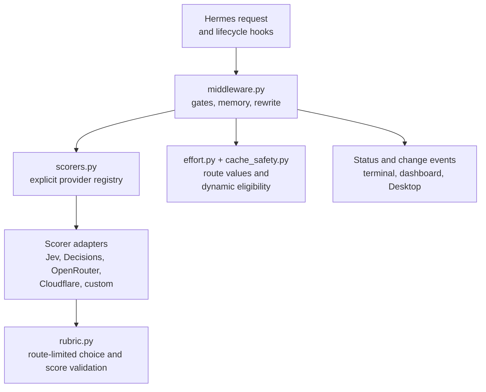

# Design and architecture

[Version française expliquée](DESIGN.fr.md)

[User guide](USAGE.md) · [Configuration](CONFIGURATION.md) · [Runtime contracts](CONTRACTS.md)

## One job

Hermes Adaptive Effort chooses the reasoning effort of an outgoing request. It keeps the conversation model selected by the user and adjusts only a supported effort control.

The maintainer built it for daily personal use and intends to maintain it through that use. That purpose favors a small plugin with a compact interface: show the routing mode first and make details available when needed.

## Components

Hermes enters through the registered middleware and lifecycle hooks. Middleware decides whether to classify, reuses bounded decisions and returns a copied request when an effort field changes. The provider registry builds only the selected adapter; adapters use the shared route-choice or legacy-score contract. Effort mapping and cache-safety checks stay separate from scorer choice.

`model_profiles.py` and its JSON catalog supply optional context to the scorer. They do not establish transport support. Status surfaces in `command.py`, `dashboard/plugin_api.py` and `desktop/plugin.js` consume allowlisted results, not task text.

## Separate scoring from answering

The scorer judges task complexity; the conversation model answers the task. The registry supports Jev, OpenAI Decisions, OpenRouter, Cloudflare and custom hosted/local endpoints. Jev is the default.

There is no fallback between scorers. A failure should not send a task to a different provider or bill a model the user did not select. The [configuration guide](CONFIGURATION.md#configure-your-scorer) owns provider setup and credentials.

The scorer receives bounded latest-user text rather than the whole conversation. This reduces the material shared but can miss context when a message depends on earlier discussion. Classification is a heuristic, not a guarantee of task difficulty or answer correctness.

When an exact model/API route has a registered vocabulary, the scorer chooses directly from those allowed names. Kimi K3 uses `low/high/max`; GPT-6.1 Sol uses `low/medium/high/xhigh/max`; Claude Opus 4.6 uses `low/medium/high/max`. A one-level route is fixed without a scorer call. Unknown vocabularies retain the legacy finite `0..2` score mapped to three labels, and `/hae probe` always uses that score contract. Model identity and observed effort are still omitted unless `use_target_model_context` is enabled; the allowed names themselves are part of the choice question.

## Choose a decision scope

The four public modes decide when a task needs a new classification. `auto` uses per-turn decisions only on exact registered dynamic routes whose transports are cache-neutral, including the separately guarded Claude per-message path. Elsewhere it retains a route decision. `once` always retains a route decision; `always` evaluates each new user turn.

An opening greeting can therefore remain authoritative in `once` even when the next task is harder. Dynamic `auto` and `always` let that next turn receive a new score. The [usage examples](USAGE.md#example-a-greeting-followed-by-a-complex-task) explain the choice; [Contracts](CONTRACTS.md#decision-scope) defines the precise scope.

During a tool loop, the turn's decision remains authoritative across route changes. The plugin clamps it for the current model's vocabulary; `xhigh` is not automatically promoted to the new route's `max`. Concurrent claims prevent duplicate scoring. Turn and retained-route decisions have separate capacity limits, so reset, eviction or reload can require another classification.

## Preserve operator intent

Parent and subagent modes default to `off`. Enabling the parent does not silently enable child routing. Selecting a scorer alone sends no task text.

Existing effort fields take precedence. Missing-field insertion requires an exact registered route or an exact model ID asserted in `effort_models`, on a known Responses/Chat Completions carrier. That operator list does not establish dynamic support. Disabled, `none` and malformed reasoning controls remain untouched; the plugin never adds a thinking toggle.

Chat mode changes live in the serving process. Persistent defaults belong to the operator's configuration or the host settings API. An explicit dashboard request can opt into persistence; [Contracts](CONTRACTS.md#dashboard-api) describes that boundary.

## Keep scorer failures out of the conversation path

Missing configuration, transport errors, timeouts, malformed choices and invalid scores leave the original request unchanged. Native-choice routes accept only a returned value from their exact allowlist, with no score fallback. Other routes use the shared finite `0..2` score and thresholds. Every adapter uses the same route-aware question and strict response validation.

This protects against scorer and plugin failures. It cannot prevent a vendor from rejecting a rewritten value when route information is inaccurate. Check current route evidence in [Compatibility](MODEL_COMPATIBILITY.md); retain retired-route observations in dated reports.

## Treat cache claims as evidence questions

Transport cache safety and exact dynamic capability are separate requirements. API family, an existing field and an operator assertion cannot independently grant dynamic status.

Retaining a decision limits changes on routes without that evidence. Memory is bounded and process-local, so this retention ends on eviction/reset/reload. Net savings and cache-hit effects require live A/B measurements; local routing tests cannot establish them.

## Observe decisions without retaining prompts

Status reports allowlisted route and effort metadata. The anonymous change feed records only transitions that reached rewritten requests. Separate session-scoped decision events let Desktop display the focused chat and synchronize its native selector when supported.

Normal task text is not persisted by the plugin. Registered child goals exist transiently in bounded memory. External scorers still receive the configured task input and have their own retention policies; see [data sharing](CONFIGURATION.md#data-sharing).

## Anthropic's cache-preserving path

For five exact Claude IDs on HTTPS `api.anthropic.com`, the plugin can use Anthropic's per-message `output_config.effort` mechanism when the outgoing request exposes an `anthropic-beta` header. It appends `mid-conversation-output-config-2026-07-01` while preserving the header's other values, then inserts an empty system message with the selected effort before that user turn. The top-level `output_config.effort` stays unchanged; Desktop therefore does not synchronize the session selector for these updates.

The plugin keeps only effort names and hashed message positions so it can replay each marker at the same boundary on later requests. It does not retain message text. Compression that removes an anchor, a changed top-level initial effort, a reset, eviction or an internal error invalidates the continuity record and fails open. `auto` uses this dynamic path only when the exact model, host, beta-header shape and controls are all eligible. Without that header, `auto` pins a decision per route; `always` may update top-level effort and marks the possibility of a cache reset in status. Local tests validate generated request shapes, not live beta acceptance or cache hits.

## Maintenance

Keep provider setup in Configuration, operator workflows in Usage, wire/API rules in Contracts and exact route evidence in Compatibility. Preserve dated reports as historical evidence.

Network-free tests exercise request rewrites, decision reuse, failure paths, settings parity and real Hermes discovery/dispatch. They do not measure provider availability or model-answer quality. The plugin uses some lazy Hermes internal imports, so host updates need compatibility checks. [Development](DEVELOPMENT.md) and [CI](CI.md) describe the checks and their limits.
